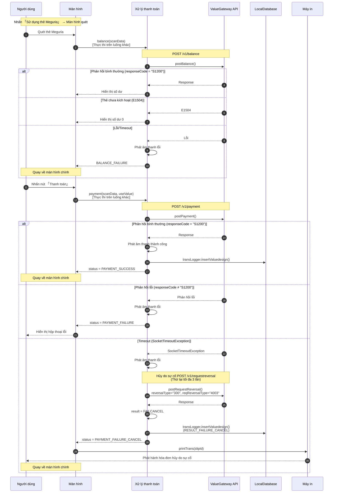

# Quy trình sử dụng tiền điện tử House

Biểu đồ tuần tự xử lý thanh toán bằng thẻ Meguria (tiền điện tử House) sử dụng ValueGateway API.

## Biểu đồ tuần tự



## Tổng quan quy trình

| Yếu tố | Nội dung |
|--------|----------|
| **Thao tác màn hình** | Màn hình chính → Quét → Giao dịch chính (hiển thị số dư) → Thanh toán → Hiển thị kết quả |
| **Giao tiếp API** | balance (Tra cứu số dư) → payment (Thanh toán value) |
| **Mẫu bình thường** | responseCode="S1200" → Phát âm thanh thành công → Lưu DB → Quay về menu |
| **Mẫu lỗi** | responseCode≠"S1200" → Phát âm thanh lỗi → Hộp thoại lỗi |
| **Timeout** | Timeout 40 giây → Phát âm thanh lỗi → Thực thi hủy do sự cố → Ghi FAILCANCEL → In hóa đơn |

## Cơ chế hủy do sự cố

| Mục | Nội dung |
|------|----------|
| **Trigger** | Xảy ra SocketTimeoutException hoặc Exception trong API thanh toán (postPayment) |
| **Xác định kết quả** | result = UNKNOWN → Bắt đầu quy trình hủy do sự cố |
| **API** | POST /v1/requestreversal |
| **Loại hủy** | reversalType = "300" (Hủy do sự cố) |
| **Loại yêu cầu hủy** | reqReversalType = "4003" (Thanh toán) |
| **Thử lại** | Tối đa 3 lần (VdParam.MAX_FAILURE_CANCEL_COUNT) |
| **Kết quả cuối cùng** | Luôn được ghi là RESULT_FAILURE_CANCEL |

## Chi tiết API

### Yêu cầu tra cứu số dư (PostBalance.Request)

| Trường | Mô tả | Giá trị |
|--------|-------|---------|
| paymentId | Số nhận dạng thanh toán | Số thẻ/Token |
| terminalNo | Số thiết bị đầu cuối | AppPreference.getVDDeviceID() |
| reqNo | Số yêu cầu | {terminalNo}-{yyyyMMdd}-{Số thứ tự} |

### Yêu cầu thanh toán value (PostPayment.Request)

| Trường | Mô tả | Giá trị |
|--------|-------|---------|
| paymentId | Số nhận dạng thanh toán | Số thẻ/Token |
| amount | Số tiền giao dịch | useValue |
| currency | Tiền tệ | "JPY" |
| terminalNo | Số thiết bị đầu cuối | Giá trị cài đặt |
| reqNo | Số yêu cầu | Phát hành mới |
| transmissionTime | Thời gian gửi | Định dạng ISO8601 |

### Yêu cầu hủy do sự cố (PostRequestReversal.Request)

| Trường | Mô tả | Giá trị |
|--------|-------|---------|
| paymentId | Số nhận dạng thanh toán | Số thẻ/Token gốc |
| targetReqNo | Số yêu cầu đích | reqNo thanh toán gốc |
| reversalType | Loại hủy | "300" (Hủy do sự cố) |
| reqReversalType | Loại yêu cầu hủy | "4003" (Thanh toán) |

### Mục phản hồi chung

| Trường | Mô tả |
|--------|-------|
| responseCode | "S1200"=Thành công, Khác=Lỗi |
| paymentMethod | Phương thức thanh toán ("100"=Thẻ Meguria) |
| valueCardDetail.balanceTotal | Số dư value (Tổng) |
| valueCardDetail.balanceBasic | Số dư cơ bản |
| valueCardDetail.balanceBonus | Số dư bonus |
| valueCardDetail.balanceCoupon | Số dư coupon |
| valueCardDetail.balancePoint | Số dư điểm |
| valueCardDetail.valueWithdraw | Số tiền sử dụng value |

## Danh sách mã lỗi

| Mã | Mô tả |
|----|-------|
| 2080 | Không có ID thiết bị đầu cuối VD |
| 2081 | Không có cài đặt truy cập VD |
| 2082 | Lỗi giao tiếp VGW (Lỗi HTTP) |
| 2083 | Hủy do sự cố thành công |
| 2084 | Đạt giới hạn thử lại hủy do sự cố |

## Các loại kết quả giao dịch (VdSettlementStatus)

| Trạng thái | Mô tả |
|-----------|-------|
| None | Trạng thái ban đầu |
| BALANCE_SUCCESS | Tra cứu số dư thành công |
| BALANCE_FAILURE | Tra cứu số dư thất bại |
| PAYMENT_SUCCESS | Thanh toán thành công |
| PAYMENT_FAILURE | Thanh toán thất bại |
| PAYMENT_FAILURE_CANCEL | Hủy do sự cố thanh toán |

## Chuyển màn hình

```
MenuHomeFragment
    ↓ Nhấn nút 「Thẻ Meguria」
ValuedesignScanFragment
    ↓ Quét thẻ
ValuedesignTransactionMainFragment
    ↓ Tra cứu số dư・Hiển thị số dư
    ↓ Nhấn nút 「Thanh toán」
    ↓ Giao tiếp API・Xử lý kết quả
MenuHomeFragment (Thành công/Hủy do sự cố)
    hoặc
ValuedesignTransactionMainFragment (Duy trì màn hình khi lỗi)
```

## Tệp liên quan

| Chức năng | Đường dẫn tệp |
|-----------|--------------|
| Màn hình chính | `ui/menu/MenuHomeFragment.java` |
| Màn hình quét | `ui/valuedesign/ValuedesignScanFragment.java` |
| Màn hình giao dịch chính | `ui/valuedesign/ValuedesignTransactionMainFragment.java` |
| ViewModel | `ui/valuedesign/ValuedesignTransactionMainViewModel.java` |
| Xử lý thanh toán | `model/valuedesign/ValuedesignSettlement.java` |
| Triển khai API | `webapi/valuegateway/ValueGatewayApilmpl.java` |
| Yêu cầu thanh toán | `webapi/valuegateway/data/PostPayment.java` |
| Yêu cầu hủy do sự cố | `webapi/valuegateway/data/PostRequestReversal.java` |
| Định nghĩa tham số | `data/valuedesign/VdParam.java` |
| Định nghĩa trạng thái thanh toán | `data/valuedesign/VdSettlementStatus.java` |
| In hóa đơn | `thread/printer/PrinterProc.java` |

## Lưu ý

1. **Thời gian timeout**: Timeout giao tiếp API là 40 giây
2. **Chờ đọc thẻ**: Timeout tại màn hình quét là 30 giây (WAIT_SCAN_TIMEOUT)
3. **Thử lại hủy do sự cố**: Tối đa 3 lần (MAX_FAILURE_CANCEL_COUNT)
4. **Thẻ chưa kích hoạt**: Lỗi E1504 được xử lý như bình thường, hiển thị số dư 0
5. **Thực thi trên luồng khác**: Tất cả giao tiếp API được thực thi trên luồng khác
