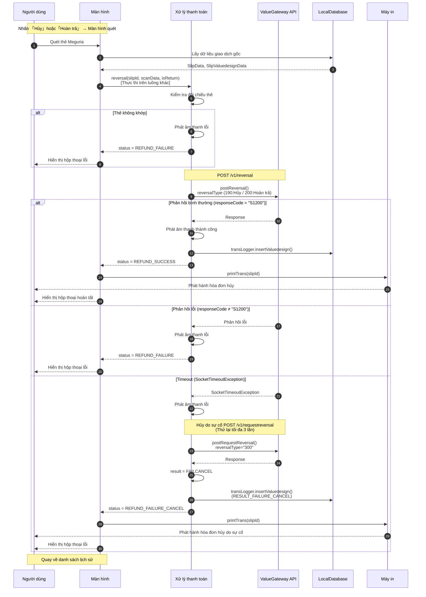

# Quy trình hủy/hoàn trả tiền điện tử House

Biểu đồ tuần tự xử lý hủy・hoàn trả thẻ Meguria (tiền điện tử House) sử dụng ValueGateway API.

## Biểu đồ tuần tự



## Tổng quan quy trình

| Yếu tố | Nội dung |
|--------|----------|
| **Thao tác màn hình** | Danh sách lịch sử → Chi tiết lịch sử → Nút hủy → Quét → Đọc thẻ → Xử lý hủy → Hiển thị kết quả |
| **Giao tiếp API** | reversal (Hủy value) |
| **Mẫu bình thường** | responseCode="S1200" → Phát âm thanh thành công → Lưu DB → In hóa đơn → Quay về danh sách lịch sử |
| **Mẫu lỗi** | responseCode≠"S1200" → Phát âm thanh lỗi → Hộp thoại lỗi → Quay về danh sách lịch sử |
| **Timeout** | Timeout 40 giây → Phát âm thanh lỗi → Thực thi hủy do sự cố → Ghi FAILCANCEL → In hóa đơn |

## Cơ chế hủy do sự cố

| Mục | Nội dung |
|------|----------|
| **Trigger** | Xảy ra SocketTimeoutException hoặc Exception trong API hủy (postReversal) |
| **Xác định kết quả** | result = UNKNOWN → Bắt đầu quy trình hủy do sự cố |
| **API** | POST /v1/requestreversal |
| **Loại hủy** | reversalType = "300" (Hủy do sự cố) |
| **Loại yêu cầu hủy** | reqReversalType = "4006" (Hủy thanh toán) / "4004" (Hủy) |
| **Thử lại** | Tối đa 3 lần (VdParam.MAX_FAILURE_CANCEL_COUNT) |
| **Kết quả cuối cùng** | Luôn được ghi là RESULT_FAILURE_CANCEL |

## Mã loại hủy

| Mã | Tên | Mô tả |
|----|-----|-------|
| 190 | REVERSAL_KIND_CANCEL | Hủy |
| 200 | REVERSAL_KIND_RETURN | Hoàn trả |
| 300 | REVERSAL_KIND_FAILURE_CANCEL | Hủy do sự cố |

## Mã loại yêu cầu hủy

| Mã | Tên | Mô tả |
|----|-----|-------|
| 4004 | REQ_REVERSAL_KIND_CANCEL | Hủy (Khi hoàn trả) |
| 4006 | REQ_REVERSAL_KIND_PAYMENT_CANCEL | Hủy thanh toán (Khi hủy thông thường) |

## Điều kiện có thể hủy

| Điều kiện | Mô tả |
|----------|-------|
| cancelFlg = 0 | Chỉ có thể hủy khi bằng 0 |
| transType = TYPE_SALES | Phải là giao dịch thanh toán |
| transResult = RESULT_SUCCESS | Phải là giao dịch đã hoàn tất bình thường |
| Đối chiếu thẻ | Phải cùng số thẻ/token với giao dịch gốc |

## Chi tiết API

### Yêu cầu hủy value (PostReversal.Request)

| Trường | Mô tả | Giá trị |
|--------|-------|---------|
| paymentId | Số nhận dạng thanh toán | Số thẻ/Token |
| amount | Số tiền hủy | transValue của giao dịch gốc |
| targetReqNo | Số yêu cầu đích | reqNoValue của giao dịch gốc |
| reversalType | Loại hủy | "190"(Hủy) / "200"(Hoàn trả) |
| terminalNo | Số thiết bị đầu cuối | Giá trị cài đặt |
| reqNo | Số yêu cầu | Phát hành mới |

### Yêu cầu hủy do sự cố (PostRequestReversal.Request)

| Trường | Mô tả | Giá trị |
|--------|-------|---------|
| paymentId | Số nhận dạng thanh toán | Số thẻ/Token gốc |
| targetReqNo | Số yêu cầu đích | reqNo hủy gốc |
| reversalType | Loại hủy | "300" (Hủy do sự cố) |
| reqReversalType | Loại yêu cầu hủy | "4006"(Hủy thanh toán) / "4004"(Hủy) |

### Mục phản hồi chung

| Trường | Mô tả |
|--------|-------|
| responseCode | "S1200"=Thành công, Khác=Lỗi |
| paymentMethod | Phương thức thanh toán ("100"=Thẻ Meguria) |
| valueCardDetail.balanceTotal | Số dư value (Tổng) |
| valueCardDetail.valueWithdrawCancel | Số tiền hủy |
| valueCardDetail.valueSendBack | Số tiền hoàn trả (Khi hoàn trả) |

## Danh sách mã lỗi

| Mã | Mô tả |
|----|-------|
| 2082 | Lỗi giao tiếp VGW (Lỗi HTTP) |
| 2083 | Hủy do sự cố thành công |
| 2084 | Đạt giới hạn thử lại hủy do sự cố |
| 2086 | Lỗi thẻ không khớp |

## Các loại kết quả giao dịch (VdSettlementStatus)

| Trạng thái | Mô tả |
|-----------|-------|
| REFUND_SUCCESS | Hủy thanh toán thành công |
| REFUND_FAILURE | Hủy thanh toán thất bại |
| REFUND_FAILURE_CANCEL | Hủy do sự cố hủy thanh toán |

## Chuyển màn hình

```
HistoryTransactionFragment (Danh sách lịch sử)
    ↓ Chọn giao dịch
HistoryTransactionDetailFragment (Chi tiết lịch sử)
    ↓ Nhấn nút 「Hủy」
ValuedesignScanFragment (Quét)
    ↓ Quét thẻ
ValuedesignTransactionBusinessFragment (Nghiệp vụ)
    ↓ Giao tiếp API hủy
    ↓ Xử lý kết quả
    ↓ In hóa đơn (Khi thành công/hủy do sự cố)
    ↓ Hiển thị hộp thoại hoàn tất/lỗi
HistoryTransactionFragment (Quay về danh sách lịch sử)
```

## Tệp liên quan

| Chức năng | Đường dẫn tệp |
|-----------|--------------|
| Màn hình danh sách lịch sử | `ui/history/HistoryTransactionFragment.java` |
| Màn hình chi tiết lịch sử | `ui/history/HistoryTransactionDetailFragment.java` |
| Màn hình quét | `ui/valuedesign/ValuedesignScanFragment.java` |
| Màn hình nghiệp vụ | `ui/valuedesign/ValuedesignTransactionBusinessFragment.java` |
| ViewModel | `ui/valuedesign/ValuedesignTransactionBusinessViewModel.java` |
| Xử lý thanh toán | `model/valuedesign/ValuedesignSettlement.java` |
| Triển khai API | `webapi/valuegateway/ValueGatewayApilmpl.java` |
| Yêu cầu hủy value | `webapi/valuegateway/data/PostReversal.java` |
| Yêu cầu hủy do sự cố | `webapi/valuegateway/data/PostRequestReversal.java` |
| Định nghĩa tham số | `data/valuedesign/VdParam.java` |
| Định nghĩa trạng thái thanh toán | `data/valuedesign/VdSettlementStatus.java` |
| Dữ liệu phiếu | `database/history/slipValuedesign/SlipValuedesignData.java` |
| In hóa đơn | `thread/printer/PrinterProc.java` |

## Lưu ý

1. **Bắt buộc đối chiếu thẻ**: Khi hủy cần cùng thẻ với giao dịch gốc (paymentId khớp hoặc kiểm tra độ dài token)
2. **Thời gian timeout**: Timeout giao tiếp API là 40 giây
3. **Thử lại hủy do sự cố**: Tối đa 3 lần (MAX_FAILURE_CANCEL_COUNT)
4. **Loại hủy**: Hủy thông thường sử dụng "190", hoàn trả sử dụng "200"
5. **In hóa đơn**: In hóa đơn khi thành công và khi hủy do sự cố
6. **Thực thi trên luồng khác**: Tất cả giao tiếp API được thực thi trên luồng khác
