# Quy trình cấp điểm

Đây là biểu đồ tuần tự (sequence diagram) mô tả quy trình xử lý cấp điểm sử dụng CSDelightApi.

## Biểu đồ tuần tự

```mermaid
sequenceDiagram
    autonumber
    participant User as Người dùng
    participant Scanner as Đọc mã vạch
    participant Home as Màn hình chính<br/>(MenuHomeFragment)
    participant PointGrant as Màn hình cấp điểm<br/>(PointGrantFragment)
    participant VM as ViewModel<br/>(PointGrantViewModel)
    participant TxMgr as Quản lý giao dịch<br/>(PointTransactionManager)
    participant API as CSDelightApi
    participant DB as LocalDatabase
    participant Printer as Máy in<br/>(PrinterProc)

    %% Từ màn hình chính đến màn hình quét mã vạch
    User->>Home: Nhấn nút "Cấp điểm"
    Home->>Home: Kiểm tra giấy máy in<br/>DeviceUtils.isPrinterPaperLack()
    Home->>Scanner: Chuyển màn hình<br/>(ValuedesignScanFragment)

    %% Quét mã vạch
    User->>Scanner: Quét thẻ thành viên
    Scanner->>Scanner: processPointCard()<br/>Trích xuất mã khách hàng
    Scanner->>PointGrant: Chuyển màn hình<br/>(truyền customerCode)

    PointGrant->>VM: Khởi tạo

    rect rgba(128, 128, 128, 0.3)
        Note over VM,TxMgr: 【Dự kiến xóa】<br/>Di chuyển ngay trước affectPoint
        VM->>TxMgr: loadCurrentBalance()
        TxMgr->>API: getPoint()<br/>/CSPointApi/CsPointService/GetPoint
        API-->>TxMgr: GetPointInfo
        TxMgr-->>VM: onSuccess(balance)
    end

    %% Bước 1: Chọn thuế suất
    PointGrant->>PointGrant: ViewPager Step0<br/>Hiển thị màn hình chọn thuế suất
    User->>PointGrant: Chọn thuế suất<br/>(Thuế suất chuẩn(10%)/Thuế suất giảm(8%)/Giá gốc(không thuế))

    %% Bước 2: Chọn phương thức thanh toán
    PointGrant->>PointGrant: ViewPager Step1<br/>Hiển thị màn hình chọn phương thức thanh toán
    User->>PointGrant: Chọn phương thức thanh toán<br/>(Tiền mặt/MEGLiA/Thẻ tín dụng v.v.)

    %% Bước 3: Nhập số tiền
    PointGrant->>PointGrant: ViewPager Step2<br/>Hiển thị màn hình nhập số tiền
    User->>PointGrant: Nhập số tiền
    VM->>VM: calculatorPointGrant()<br/>Tính điểm cấp

    %% Bước 4: Màn hình xác nhận
    PointGrant->>PointGrant: ViewPager Step3<br/>Hiển thị màn hình xác nhận
    User->>PointGrant: Nhấn nút "Cấp điểm"

    %% Thực thi API cấp điểm
    PointGrant->>VM: grantPoint()
    VM->>TxMgr: executePointTransaction()

    rect rgba(128, 128, 128, 0.3)
        Note over TxMgr: 【Dự kiến xóa】<br/>Thống nhất với xử lý lỗi tra cứu số dư
        TxMgr->>TxMgr: Kiểm tra kết nối mạng
    end

    rect rgba(255, 165, 0, 0.3)
        Note over TxMgr,API: 【Dự kiến thay đổi】Thay đổi thời điểm tra cứu số dư
        %% Tra cứu số dư (ngay trước affectPoint)
        TxMgr->>API: getPoint()<br/>/CSPointApi/CsPointService/GetPoint

        alt Phản hồi bình thường (HTTP200 + resultCode=0)
            API-->>TxMgr: GetPointInfo<br/>(lapseDueDate)
            Note over TxMgr: Lưu ngày hết hạn điểm(lapseDueDate)<br/>để in hóa đơn
        else Phản hồi lỗi (HTTP200 + resultCode≠0)
            API-->>TxMgr: Phản hồi lỗi<br/>(resultCode, errorMessage)
            rect rgba(255, 165, 0, 0.3)
                Note over TxMgr,VM: 【Dự kiến thay đổi】Thay đổi thời điểm phát âm thanh lỗi
                TxMgr-->>VM: onPlayErrorSound()
                VM->>VM: Phát âm thanh lỗi
            end
            TxMgr->>TxMgr: getErrorResIdForResultCode()
            TxMgr->>DB: insertSlipData()<br/>(transResult=ERROR)
            TxMgr->>Printer: printErrorReceipt()
            Note over Printer: 【Dự kiến thay đổi】Thêm phát hành hóa đơn chưa hoàn tất
            Printer-->>User: Phát hành hóa đơn chưa hoàn tất<br/>(ResultCode, ErrorMessage)
            TxMgr-->>VM: onError(errorResId)
            VM-->>PointGrant: Hiển thị hộp thoại lỗi<br/>(Mã lỗi 2060-2078)
            User->>PointGrant: Xác nhận hộp thoại
            PointGrant-->>Home: Quay về menu
        else Lỗi HTTP (Timeout/Lỗi kết nối/Status≠200)
            API--xTxMgr: SocketTimeoutException<br/>HttpStatusException
            rect rgba(255, 165, 0, 0.3)
                Note over TxMgr,VM: 【Dự kiến thay đổi】Thay đổi thời điểm phát âm thanh lỗi
                TxMgr-->>VM: onPlayErrorSound()
                VM->>VM: Phát âm thanh lỗi
            end
            TxMgr->>DB: insertSlipData()<br/>(transResult=UNFINISHED)
            TxMgr->>Printer: printErrorReceipt()
            Note over Printer: 【Dự kiến thay đổi】Thêm phát hành hóa đơn chưa hoàn tất
            Printer-->>User: Phát hành hóa đơn chưa hoàn tất<br/>(Mã trạng thái, Lỗi kết nối)
            TxMgr-->>VM: onError(errorResId)
            VM-->>PointGrant: Hiển thị hộp thoại lỗi<br/>(Mã lỗi 2079)
            User->>PointGrant: Xác nhận hộp thoại
            PointGrant-->>Home: Quay về menu
        end
    end

    TxMgr->>API: affectPoint()<br/>/CSPointApi/CsPointService/AffectPoint<br/>(pointFlag=1, amountOfChange)

    alt Phản hồi bình thường (HTTP200 + resultCode=0)
        API-->>TxMgr: AffectPointInfo<br/>(totalPoint, beforeTotalPoint, amountOfChange)
        rect rgba(255, 165, 0, 0.3)
            Note over TxMgr,VM: 【Dự kiến thay đổi】Thay đổi thời điểm phát âm thanh thành công
            TxMgr-->>VM: onPlaySuccessSound()
            VM->>VM: Phát âm thanh thành công
        end
        TxMgr->>DB: insertSlipData()<br/>insertReceipt()
        TxMgr->>Printer: printReceipt(slipId)
        Printer->>Printer: printTrans()<br/>In hóa đơn cấp điểm
        Printer-->>User: Phát hành hóa đơn
        TxMgr-->>VM: onSuccess(newBalance)
        VM-->>PointGrant: Hoàn tất xử lý
        PointGrant-->>Home: Quay về menu

    else Phản hồi lỗi (HTTP200 + resultCode≠0)
        API-->>TxMgr: Phản hồi lỗi<br/>(resultCode, errorMessage)
        rect rgba(255, 165, 0, 0.3)
            Note over TxMgr,VM: 【Dự kiến thay đổi】Thay đổi thời điểm phát âm thanh lỗi
            TxMgr-->>VM: onPlayErrorSound()
            VM->>VM: Phát âm thanh lỗi
        end
        TxMgr->>TxMgr: getErrorResIdForResultCode()
        TxMgr->>DB: insertSlipData()<br/>(transResult=ERROR)
        TxMgr->>Printer: printErrorReceipt()
        rect rgba(255, 165, 0, 0.3)
            Note over Printer: 【Dự kiến thay đổi】
            Printer-->>User: Phát hành hóa đơn chưa hoàn tất<br/>(ResultCode, ErrorMessage)
        end
        TxMgr-->>VM: onError(errorResId)
        VM-->>PointGrant: Hiển thị hộp thoại lỗi<br/>(Mã lỗi 2060-2078)
        User->>PointGrant: Xác nhận hộp thoại
        PointGrant-->>Home: Quay về menu

    else Lỗi HTTP (Timeout/Lỗi kết nối/Status≠200)
        API--xTxMgr: SocketTimeoutException<br/>HttpStatusException
        rect rgba(255, 165, 0, 0.3)
            Note over TxMgr,VM: 【Dự kiến thay đổi】Thay đổi thời điểm phát âm thanh lỗi
            TxMgr-->>VM: onPlayErrorSound()
            VM->>VM: Phát âm thanh lỗi
        end
        TxMgr->>DB: insertSlipData()<br/>(transResult=UNFINISHED)
        TxMgr->>Printer: printErrorReceipt()
        rect rgba(255, 165, 0, 0.3)
            Note over Printer: 【Dự kiến thay đổi】
            Printer-->>User: Phát hành hóa đơn chưa hoàn tất<br/>(Mã trạng thái, Lỗi kết nối)
        end
        TxMgr-->>VM: onError(errorResId)
        VM-->>PointGrant: Hiển thị hộp thoại lỗi<br/>(Mã lỗi 2079)
        User->>PointGrant: Xác nhận hộp thoại
        PointGrant-->>Home: Quay về menu
    end
```



## Tổng quan quy trình

| Yếu tố | Nội dung |
|--------|---------|
| **Thao tác màn hình** | Màn hình chính → Quét mã vạch → Màn hình cấp điểm(4 bước) → Xác nhận |
| **Các bước nhập liệu** | Chọn thuế suất → Chọn phương thức thanh toán → Nhập số tiền → Xác nhận |
| **Giao tiếp API** | getPoint (Tra cứu số dư/ngay trước affectPoint) → affectPoint (Cấp điểm) |
| **Mẫu bình thường** | HTTP200 + resultCode=0 → 【Dự kiến thay đổi】Phát âm thanh thành công → Lưu DB → In hóa đơn → Quay về menu |
| **Chưa kết nối mạng** | 【Dự kiến xóa】Hiển thị hộp thoại lỗi → Quay về menu (không in hóa đơn) |
| **Phản hồi lỗi** | HTTP200 + resultCode≠0 → 【Dự kiến thay đổi】Phát âm thanh lỗi → Hóa đơn chưa hoàn tất → Hộp thoại lỗi |
| **Lỗi HTTP** | Timeout/Lỗi kết nối/Status≠200 → 【Dự kiến thay đổi】Phát âm thanh lỗi → Hóa đơn chưa hoàn tất → Hộp thoại lỗi |

### Dự kiến thay đổi

| Mục | Hành vi hiện tại | Hành vi sau khi thay đổi |
|-----|-----------------|-------------------------|
| **Thời điểm tra cứu số dư** | Thực thi getPoint khi khởi tạo màn hình | Thực thi getPoint ngay trước affectPoint |
| **Kiểm tra mạng trước khi tra cứu số dư** | Kiểm tra mạng → Nếu chưa kết nối thì quay về menu | Xóa kiểm tra mạng, thống nhất với xử lý lỗi tra cứu số dư |
| **Hóa đơn chưa hoàn tất khi lỗi tra cứu số dư** | Không phát hành hóa đơn chưa hoàn tất | Thêm phát hành hóa đơn chưa hoàn tất |
| **Nội dung in hóa đơn chưa hoàn tất (Phản hồi lỗi)** | Thông báo lỗi cố định | In ResultCode, ErrorMessage |
| **Nội dung in hóa đơn chưa hoàn tất (Lỗi HTTP)** | Thông báo lỗi cố định | In mã trạng thái, "Lỗi kết nối" |
| **Thời điểm phát âm thanh thành công** | Phát âm thanh thành công sau khi lưu DB và in hóa đơn (onSuccess) | Phát âm thanh thành công sau khi API phản hồi bình thường, trước khi lưu DB và in hóa đơn (onPlaySuccessSound) |
| **Thời điểm phát âm thanh lỗi** | Phát âm thanh lỗi sau khi lưu DB và in hóa đơn chưa hoàn tất (onError) | Phát âm thanh lỗi sau khi API phản hồi lỗi, trước khi lưu DB và in hóa đơn chưa hoàn tất (onPlayErrorSound) |

## Logic tính điểm

※ Xử lý làm tròn thuế tiêu dùng và làm tròn điểm: làm tròn xuống phần thập phân

```
1. Tính số tiền đối tượng quy đổi
   Số tiền đối tượng quy đổi = Số tiền nhập - (Số tiền nhập × Thuế suất tiêu dùng) ÷ (100 + Thuế suất tiêu dùng)

2. Tính điểm thông thường
   Điểm thông thường = (Số tiền đối tượng quy đổi ÷ Số tiền chuẩn) × Điểm chuẩn

3. Tính điểm cấp (áp dụng hệ số chiến dịch)
   Điểm cấp = Điểm thông thường × Hệ số điểm đã áp dụng

4. Điểm thời kỳ tăng thêm
   Điểm thời kỳ tăng thêm = Điểm cấp - Điểm thông thường
```

### Dự kiến thay đổi (Logic tính toán)

| Mục | Hành vi hiện tại | Hành vi sau khi thay đổi |
|-----|-----------------|-------------------------|
| **Xử lý làm tròn** | Làm tròn | Làm tròn xuống phần thập phân |

## Chi tiết API

### Request (PointRequest)

| Trường | Mô tả |
|--------|-------|
| CustomerId | ID khách hàng (12 chữ số) |
| FinancialDate | Ngày giao dịch (yyyyMMdd) |
| FinancialTime | Thời gian giao dịch (HHmmss000) |
| StoreId | Mã cửa hàng |
| TerminalNo | Số thiết bị đầu cuối |
| FinancialSerialNumber | Số serial giao dịch |
| PointFlag | 0=Sử dụng điểm, 1=Cấp điểm |
| AmountOfChange | Lượng thay đổi điểm |

### Response (PointResponse)

| Trường | Mô tả |
|--------|-------|
| ResultCode | 0=Thành công, 1-99=Mã lỗi |
| AffectPointInfo.TotalPoint | Số dư điểm hiện tại |
| AffectPointInfo.BeforeTotalPoint | Số dư điểm trước giao dịch |
| AffectPointInfo.AmountOfChange | Lượng thay đổi điểm |
| ErrorMessage | Thông báo lỗi |

## Danh sách mã lỗi

| ResultCode | Mã lỗi | Mô tả |
|------------|--------|-------|
| 1 | 2060 | CSDelight Result 1 |
| 2 | 2061 | CSDelight Result 2 |
| 3 | 2062 | CSDelight Result 3 |
| 10 | 2063 | CSDelight Result 10 |
| 60 | 2064 | CSDelight Result 60 |
| 61 | 2065 | CSDelight Result 61 |
| 96 | 2066 | CSDelight Result 96 |
| 97 | 2067 | CSDelight Result 97 |
| 98 | 2068 | CSDelight Result 98 |
| 99 | 2069 | CSDelight Result 99 |
| Khác | 2078 | ResultCode chưa định nghĩa |
| HTTP Error | 2079 | Lỗi trạng thái HTTP |

## Các file liên quan

| Chức năng | Đường dẫn file |
|-----------|---------------|
| Xử lý sự kiện màn hình chính | `ui/menu/MenuEventHandlersImpl.java` |
| Màn hình quét mã vạch | `ui/valuedesign/ValuedesignScanFragment.java` |
| Màn hình cấp điểm chính | `toyota/menu/point_grant/PointGrantFragment.java` |
| ViewModel | `toyota/menu/point_grant/PointGrantViewModel.java` |
| Xử lý sự kiện | `toyota/menu/point_grant/PointGrantEventHandlers.java` |
| Màn hình chọn thuế suất | `toyota/menu/point_grant/TaxRateSelectFragment.java` |
| Màn hình chọn phương thức thanh toán | `toyota/menu/point_grant/PaymentMethodSelectFragment.java` |
| Màn hình nhập số tiền | `toyota/menu/point_grant/AmountInputFragment.java` |
| Màn hình xác nhận | `toyota/menu/point_grant/ConfirmGrantPointFragment.java` |
| Quản lý giao dịch | `toyota/menu/point_grant/PointTransactionManager.java` |
| Định nghĩa API | `webapi/csdelight/CSDelightApi.java` |
| Triển khai API | `webapi/csdelight/CSDelightApiImpl.java` |
| In hóa đơn | `thread/printer/PrinterProc.java` |
