# Quy trình hủy cấp điểm

Đây là biểu đồ tuần tự xử lý hủy cấp điểm sử dụng CSDelightApi.

## Biểu đồ tuần tự

```mermaid
sequenceDiagram
    autonumber
    participant User as Người dùng
    participant HistoryList as Màn hình danh sách lịch sử<br/>(HistoryTransactionFragment)
    participant HistoryDetail as Màn hình chi tiết lịch sử<br/>(HistoryTransactionDetailFragment)
    participant VM as ViewModel<br/>(HistoryTransactionDetailViewModel)
    participant TxMgr as Quản lý giao dịch<br/>(PointTransactionManager)
    participant API as CSDelightApi
    participant DB as LocalDatabase
    participant Printer as Máy in<br/>(PrinterProc)

    %% Từ danh sách lịch sử đến màn hình chi tiết
    User->>HistoryList: Chọn giao dịch cần hủy
    HistoryList->>HistoryDetail: Chuyển màn hình<br/>(truyền slipId)
    HistoryDetail->>VM: getLastTransaction(slipId)
    VM->>DB: Lấy dữ liệu giao dịch gốc<br/>(SlipData, ReceiptData)
    DB-->>VM: Dữ liệu giao dịch
    VM-->>HistoryDetail: Hiển thị chi tiết giao dịch

    %% Kiểm tra khả năng hủy (khi hiển thị màn hình)
    HistoryDetail->>HistoryDetail: Kiểm tra khả năng hủy<br/>(cancelFlg, transType, transResult)

    alt Không thể hủy
        HistoryDetail-->>User: Ẩn nút hủy
    end

    %% Nhấn nút hủy
    User->>HistoryDetail: Nhấn nút 「Hủy」

    %% Hộp thoại xác nhận
    HistoryDetail->>HistoryDetail: Hiển thị hộp thoại xác nhận<br/>(Hủy cấp điểm)
    User->>HistoryDetail: Nhấn 「Thực hiện」

    %% Bắt đầu xử lý hủy
    HistoryDetail->>VM: refundMegliaPoint(slipId)
    VM->>TxMgr: cancelPointTransaction(slipId, customerCode, callback)

    %% Lấy thông tin giao dịch gốc
    TxMgr->>DB: getOneById(slipId)
    DB-->>TxMgr: originSlipData<br/>(transType=TYPE_POINT_GRANT)
    TxMgr->>DB: getReceiptsBySlipId(slipId)
    DB-->>TxMgr: receiptData<br/>(Thuế suất, Số tiền chuẩn, Điểm chuẩn, v.v.)

    %% Kiểm tra mạng
    rect rgba(128, 128, 128, 0.3)
        Note over TxMgr: 【Dự kiến xóa】<br/>Thống nhất với lỗi tra cứu số dư
        TxMgr->>TxMgr: Kiểm tra kết nối mạng
        alt Mạng chưa kết nối
            TxMgr-->>VM: onError(Lỗi kết nối Internet)
            VM->>VM: Phát âm thanh lỗi
            VM-->>HistoryDetail: Hiển thị hộp thoại lỗi
            User->>HistoryDetail: Xác nhận hộp thoại
        end
    end

    %% Tra cứu số dư
    TxMgr->>API: getPoint()<br/>/CSPointApi/CsPointService/GetPoint

    alt Phản hồi bình thường (HTTP200 + resultCode=0)
        API-->>TxMgr: GetPointInfo<br/>(lapseDueDate)
        Note over TxMgr: Giữ thời hạn hiệu lực điểm (lapseDueDate)<br/>để in hóa đơn
    else Phản hồi lỗi (HTTP200 + resultCode≠0)
        API-->>TxMgr: Phản hồi lỗi<br/>(resultCode, errorMessage)
        rect rgba(255, 165, 0, 0.3)
            Note over TxMgr,VM: 【Dự kiến thay đổi】Thay đổi thời điểm phát âm thanh lỗi
            TxMgr-->>VM: onPlayErrorSound()
            VM->>VM: Phát âm thanh lỗi
        end
        TxMgr->>TxMgr: getErrorResIdForResultCode()
        rect rgba(255, 165, 0, 0.3)
            Note over TxMgr,Printer: 【Dự kiến thay đổi】Thêm phát hành hóa đơn chưa hoàn thành<br/>Cập nhật giao dịch gốc thành không thể hủy
            TxMgr->>DB: insertSlipData()<br/>(transResult=ERROR)
            TxMgr->>DB: updateOldOriginSlip(originalSlipId)
            Note over DB: Cập nhật cancelFlg=1 của giao dịch gốc
            TxMgr->>Printer: printErrorReceipt()
            Printer-->>User: Phát hành hóa đơn chưa hoàn thành<br/>(ResultCode, ErrorMessage)
        end
        TxMgr-->>VM: onError(errorResId)
        VM-->>HistoryDetail: Hiển thị hộp thoại lỗi<br/>(Mã lỗi 2060-2078)
        User->>HistoryDetail: Xác nhận hộp thoại
        HistoryDetail-->>HistoryList: Quay lại danh sách lịch sử
    else Lỗi HTTP (Timeout/Lỗi truyền thông/Status≠200)
        API--xTxMgr: SocketTimeoutException<br/>HttpStatusException
        rect rgba(255, 165, 0, 0.3)
            Note over TxMgr,VM: 【Dự kiến thay đổi】Thay đổi thời điểm phát âm thanh lỗi
            TxMgr-->>VM: onPlayErrorSound()
            VM->>VM: Phát âm thanh lỗi
        end
        rect rgba(255, 165, 0, 0.3)
            Note over TxMgr,Printer: 【Dự kiến thay đổi】Thêm phát hành hóa đơn chưa hoàn thành<br/>Cập nhật giao dịch gốc thành không thể hủy
            TxMgr->>DB: insertSlipData()<br/>(transResult=UNFINISHED)
            TxMgr->>DB: updateOldOriginSlip(originalSlipId)
            Note over DB: Cập nhật cancelFlg=1 của giao dịch gốc
            TxMgr->>Printer: printErrorReceipt()
            Printer-->>User: Phát hành hóa đơn chưa hoàn thành<br/>(Mã trạng thái, Lỗi truyền thông)
        end
        TxMgr-->>VM: onError(errorResId)
        VM-->>HistoryDetail: Hiển thị hộp thoại lỗi<br/>(Mã lỗi 2079)
        User->>HistoryDetail: Xác nhận hộp thoại
        HistoryDetail-->>HistoryList: Quay lại danh sách lịch sử
    end

    %% Thực thi API hủy điểm (Hủy cấp = Thực thi như sử dụng)
    Note over TxMgr: Hủy cấp = Thực thi như sử dụng điểm<br/>(cancelPointFlag = POINT_USE = 0)
    TxMgr->>API: affectPoint()<br/>/CSPointApi/CsPointService/AffectPoint<br/>(pointFlag=0, amountOfChange=Số điểm hủy)

    alt Phản hồi bình thường (HTTP200 + resultCode=0)
        API-->>TxMgr: AffectPointInfo<br/>(totalPoint, beforeTotalPoint, amountOfChange)
        rect rgba(255, 165, 0, 0.3)
            Note over TxMgr,VM: 【Dự kiến thay đổi】Thay đổi thời điểm phát âm thanh thành công
            TxMgr-->>VM: onPlaySuccessSound()
            VM->>VM: Phát âm thanh thành công
        end
        TxMgr->>DB: createAndSaveCancelReceiptData()<br/>insertSlipData(transType=TYPE_POINT_GRANT_CANCEL)<br/>insertReceipt()
        TxMgr->>DB: updateOldOriginSlip(originalSlipId)
        Note over DB: Cập nhật cancelFlg=1 của giao dịch gốc
        TxMgr->>Printer: printReceipt(cancelSlipId)
        Printer->>Printer: printTrans()<br/>In hóa đơn hủy cấp điểm
        Printer-->>User: Phát hành hóa đơn hủy
        TxMgr-->>VM: onSuccess(newBalance)
        VM-->>HistoryDetail: Hoàn thành xử lý
        HistoryDetail-->>HistoryList: Quay lại danh sách lịch sử

    else Phản hồi lỗi (HTTP200 + resultCode≠0)
        API-->>TxMgr: Phản hồi lỗi<br/>(resultCode, errorMessage)
        rect rgba(255, 165, 0, 0.3)
            Note over TxMgr,VM: 【Dự kiến thay đổi】Thay đổi thời điểm phát âm thanh lỗi
            TxMgr-->>VM: onPlayErrorSound()
            VM->>VM: Phát âm thanh lỗi
        end
        TxMgr->>TxMgr: getErrorResIdForResultCode()
        rect rgba(255, 165, 0, 0.3)
            Note over TxMgr,Printer: 【Dự kiến thay đổi】Thêm phát hành hóa đơn chưa hoàn thành<br/>Cập nhật giao dịch gốc thành không thể hủy
            TxMgr->>DB: insertSlipData()<br/>(transResult=ERROR)
            TxMgr->>DB: updateOldOriginSlip(originalSlipId)
            Note over DB: Cập nhật cancelFlg=1 của giao dịch gốc
            TxMgr->>Printer: printErrorReceipt()
            Printer-->>User: Phát hành hóa đơn chưa hoàn thành<br/>(ResultCode, ErrorMessage)
        end
        TxMgr-->>VM: onError(errorResId)
        VM-->>HistoryDetail: Hiển thị hộp thoại lỗi<br/>(Mã lỗi 2060-2078)
        User->>HistoryDetail: Xác nhận hộp thoại
        HistoryDetail-->>HistoryList: Quay lại danh sách lịch sử

    else Lỗi HTTP (Timeout/Lỗi truyền thông/Status≠200)
        API--xTxMgr: SocketTimeoutException<br/>HttpStatusException
        rect rgba(255, 165, 0, 0.3)
            Note over TxMgr,VM: 【Dự kiến thay đổi】Thay đổi thời điểm phát âm thanh lỗi
            TxMgr-->>VM: onPlayErrorSound()
            VM->>VM: Phát âm thanh lỗi
        end
        rect rgba(255, 165, 0, 0.3)
            Note over TxMgr,Printer: 【Dự kiến thay đổi】Thêm phát hành hóa đơn chưa hoàn thành<br/>Cập nhật giao dịch gốc thành không thể hủy
            TxMgr->>DB: insertSlipData()<br/>(transResult=UNFINISHED)
            TxMgr->>DB: updateOldOriginSlip(originalSlipId)
            Note over DB: Cập nhật cancelFlg=1 của giao dịch gốc
            TxMgr->>Printer: printErrorReceipt()
            Printer-->>User: Phát hành hóa đơn chưa hoàn thành<br/>(Mã trạng thái, Lỗi truyền thông)
        end
        TxMgr-->>VM: onError(errorResId)
        VM-->>HistoryDetail: Hiển thị hộp thoại lỗi<br/>(Mã lỗi 2079)
        User->>HistoryDetail: Xác nhận hộp thoại
        HistoryDetail-->>HistoryList: Quay lại danh sách lịch sử
    end
```



## Tổng quan quy trình

| Yếu tố | Nội dung |
|--------|----------|
| **Thao tác màn hình** | Danh sách lịch sử → Chi tiết lịch sử → Nút hủy → Hộp thoại xác nhận → Hoàn thành |
| **Loại giao dịch gốc** | TYPE_POINT_GRANT (9) |
| **Loại giao dịch sau hủy** | TYPE_POINT_GRANT_CANCEL (11) |
| **Giao tiếp API** | getPoint (Tra cứu số dư) → affectPoint (Thực thi như sử dụng với pointFlag=0) |
| **Mẫu bình thường** | HTTP200 + resultCode=0 → 【Dự kiến thay đổi】Phát âm thanh thành công → Lưu DB → Cập nhật giao dịch gốc → In hóa đơn → Quay lại danh sách lịch sử |
| **Lỗi tra cứu số dư** | 【Dự kiến thay đổi】Phát âm thanh lỗi → Hóa đơn chưa hoàn thành・Cập nhật giao dịch gốc → Hộp thoại lỗi → Quay lại danh sách lịch sử |
| **Lỗi affectPoint** | 【Dự kiến thay đổi】Phát âm thanh lỗi → Hóa đơn chưa hoàn thành・Cập nhật giao dịch gốc → Hộp thoại lỗi → Quay lại danh sách lịch sử |

### Dự kiến thay đổi

| Mục | Hành vi hiện tại | Hành vi sau khi thay đổi |
|-----|------------------|--------------------------|
| **Kiểm tra mạng trước khi hủy** | Kiểm tra mạng → Hộp thoại lỗi khi chưa kết nối | Xóa kiểm tra mạng, thống nhất với xử lý lỗi tra cứu số dư |
| **Hóa đơn chưa hoàn thành khi lỗi tra cứu số dư** | Không phát hành hóa đơn chưa hoàn thành | Thêm phát hành hóa đơn chưa hoàn thành |
| **Cập nhật giao dịch gốc khi lỗi tra cứu số dư** | Duy trì trạng thái giao dịch gốc | Cập nhật giao dịch gốc thành không thể hủy (ngăn hủy lại) |
| **Hóa đơn chưa hoàn thành khi lỗi affectPoint** | Không phát hành hóa đơn chưa hoàn thành | Thêm phát hành hóa đơn chưa hoàn thành |
| **Cập nhật giao dịch gốc khi lỗi affectPoint** | Duy trì trạng thái giao dịch gốc | Cập nhật giao dịch gốc thành không thể hủy (ngăn hủy lại) |
| **Nội dung in hóa đơn chưa hoàn thành (Phản hồi lỗi)** | - | In ResultCode, ErrorMessage |
| **Nội dung in hóa đơn chưa hoàn thành (Lỗi HTTP)** | - | In mã trạng thái, "Lỗi truyền thông" |
| **Thời điểm phát âm thanh thành công** | Phát âm thanh thành công sau khi lưu DB・In hóa đơn (onSuccess) | Phát âm thanh thành công sau phản hồi bình thường API, trước khi lưu DB・In hóa đơn (onPlaySuccessSound) |
| **Thời điểm phát âm thanh lỗi** | Phát âm thanh lỗi sau khi lưu DB・In hóa đơn chưa hoàn thành (onError) | Phát âm thanh lỗi sau phản hồi lỗi API, trước khi lưu DB・In hóa đơn chưa hoàn thành (onPlayErrorSound) |

## Điều kiện có thể hủy

| Điều kiện | Giải thích |
|-----------|-----------|
| cancelFlg = 0 | Chỉ có thể hủy khi = 0 |
| transType = TYPE_POINT_GRANT | Phải là giao dịch cấp điểm |
| transBrand = "MEGLIA" | Phải là thương hiệu MEGLiA |
| transResult = RESULT_SUCCESS | Phải là giao dịch đã hoàn thành bình thường |

## Logic xử lý hủy

```
1. Lấy thông tin giao dịch gốc
   - SlipData: transType, point, transId(customerCode)
   - ReceiptData: Thuế suất, Số tiền chuẩn, Điểm chuẩn, Tỷ lệ điểm

2. Quyết định thao tác ngược lại
   - Khi giao dịch gốc là cấp điểm (pointFlag=1)
   - Thao tác hủy được thực thi như sử dụng điểm (pointFlag=0)

3. Số điểm hủy
   - Điểm hủy = Giá trị point của giao dịch gốc

4. Cập nhật DB
   - Tạo SlipData mới (transType=TYPE_POINT_GRANT_CANCEL)
   - Tạo ReceiptData mới
   - Cập nhật cancelFlg của SlipData gốc (updateOldOriginSlip)
```

## Chi tiết API

### Yêu cầu hủy (PointRequest)

| Trường | Giải thích | Giá trị khi hủy |
|--------|-----------|----------------|
| CustomerId | ID khách hàng (12 chữ số) | transId của giao dịch gốc |
| FinancialDate | Ngày giao dịch (yyyyMMdd) | Ngày giờ hiện tại |
| FinancialTime | Thời gian giao dịch (HHmmss000) | Ngày giờ hiện tại |
| StoreId | Mã cửa hàng | Giá trị cài đặt |
| TerminalNo | Số thiết bị | Giá trị cài đặt |
| FinancialSerialNumber | Số serial giao dịch | Phát số mới |
| PointFlag | Loại thao tác điểm | 0 (Thực thi như sử dụng điểm) |
| AmountOfChange | Lượng thay đổi điểm | Giá trị point của giao dịch gốc |

### Phản hồi (PointResponse)

| Trường | Giải thích |
|--------|-----------|
| ResultCode | 0=Thành công, 1-99=Mã lỗi |
| AffectPointInfo.TotalPoint | Số dư điểm sau khi hủy |
| AffectPointInfo.BeforeTotalPoint | Số dư điểm trước khi hủy |
| AffectPointInfo.AmountOfChange | Lượng thay đổi điểm |
| ErrorMessage | Thông báo lỗi |

## Danh sách mã lỗi

| ResultCode | Mã lỗi | Giải thích |
|------------|--------|-----------|
| 1 | 2060 | CSDelight Result 1 |
| 2 | 2061 | CSDelight Result 2 |
| 3 | 2062 | CSDelight Result 3 |
| 10 | 2063 | CSDelight Result 10 |
| 60 | 2064 | CSDelight Result 60 |
| 61 | 2065 | CSDelight Result 61 |
| 96 | 2066 | CSDelight Result 96 |
| 97 | 2067 | CSDelight Result 97 |
| 98 | 2068 | CSDelight Result 98 |
| 99 | 2069 | CSDelight Result 99 |
| Khác | 2078 | ResultCode chưa định nghĩa |
| HTTP Error | 2079 | Lỗi trạng thái HTTP |

## Tệp liên quan

| Chức năng | Đường dẫn tệp |
|-----------|--------------|
| Màn hình danh sách lịch sử | `ui/history/HistoryTransactionFragment.java` |
| Màn hình chi tiết lịch sử | `ui/history/HistoryTransactionDetailFragment.java` |
| ViewModel | `ui/history/HistoryTransactionDetailViewModel.java` |
| Xử lý sự kiện | `ui/history/HistoryEventHandlersImpl.java` |
| Quản lý giao dịch | `toyota/menu/point_grant/PointTransactionManager.java` |
| Định nghĩa API | `webapi/csdelight/CSDelightApi.java` |
| Triển khai API | `webapi/csdelight/CSDelightApiImpl.java` |
| In hóa đơn | `thread/printer/PrinterProc.java` |
| Định nghĩa loại giao dịch | `data/TransMap.java` |

## So sánh hủy sử dụng điểm và hủy cấp điểm

| Mục | Hủy sử dụng điểm | Hủy cấp điểm |
|-----|------------------|--------------|
| Loại giao dịch gốc | TYPE_POINT_USE (8) | TYPE_POINT_GRANT (9) |
| Loại sau hủy | TYPE_POINT_USE_CANCEL (10) | TYPE_POINT_GRANT_CANCEL (11) |
| Thao tác hủy | Cấp điểm (pointFlag=1) | Sử dụng điểm (pointFlag=0) |
| Biến động số dư điểm | Tăng (trả lại) | Giảm (tiêu dùng) |
