# Quy trình sử dụng điểm

Biểu đồ tuần tự xử lý sử dụng điểm sử dụng CSDelightApi.

## Biểu đồ tuần tự

```mermaid
sequenceDiagram
    autonumber
    participant User as Người dùng
    participant Scanner as Đọc<br/>mã vạch
    participant Home as Màn hình chính<br/>(MenuHomeFragment)
    participant PointUse as Màn hình sử dụng điểm<br/>(PointUseFragment)
    participant VM as ViewModel<br/>(PointUseViewModel)
    participant TxMgr as Quản lý giao dịch<br/>(PointTransactionManager)
    participant API as CSDelightApi
    participant DB as LocalDatabase
    participant Printer as Máy in<br/>(PrinterProc)

    %% Từ màn hình chính đến màn hình quét mã vạch
    User->>Home: Nhấn nút "Sử dụng điểm"
    Home->>Home: Kiểm tra giấy máy in<br/>DeviceUtils.isPrinterPaperLack()
    Home->>Scanner: Chuyển màn hình<br/>(ValuedesignScanFragment)

    %% Quét mã vạch
    User->>Scanner: Quét thẻ thành viên
    Scanner->>Scanner: processPointCard()<br/>Trích xuất mã khách hàng
    Scanner->>PointUse: Chuyển màn hình<br/>(truyền customerCode)

    %% Tra cứu số dư
    PointUse->>VM: Khởi tạo
    VM->>TxMgr: loadCurrentBalance()

    rect rgba(128, 128, 128, 0.3)
        Note over TxMgr: 【Dự kiến xóa】<br/>Thống nhất với lỗi tra cứu số dư
        TxMgr->>TxMgr: Kiểm tra kết nối mạng
    end

    TxMgr->>API: getPoint()<br/>/CSPointApi/CsPointService/GetPoint

    alt Phản hồi bình thường (HTTP200 + resultCode=0)
        API-->>TxMgr: GetPointInfo<br/>(totalPoint, lapseDueDate)
        Note over TxMgr: Số dư điểm hiện tại(totalPoint): Dùng để hiển thị màn hình<br/>Ngày hết hạn điểm(lapseDueDate): Lưu để in hóa đơn
        TxMgr-->>VM: onSuccess(balance)
        VM-->>PointUse: Hiển thị số dư điểm hiện tại
    else Phản hồi lỗi (HTTP200 + resultCode≠0)
        API-->>TxMgr: Phản hồi lỗi<br/>(resultCode, errorMessage)
        TxMgr-->>VM: onError(errorResId)
        VM->>VM: Phát âm thanh lỗi
        rect rgba(255, 165, 0, 0.3)
            Note over PointUse: 【Dự kiến thay đổi】
            VM-->>PointUse: Hiển thị dialog lỗi<br/>(Không thể lấy số dư)
            VM-->>PointUse: Hiển thị điểm 0 yên
        end
    else Lỗi HTTP (Timeout/Lỗi kết nối/Status≠200)
        API--xTxMgr: SocketTimeoutException<br/>HttpStatusException
        TxMgr-->>VM: onError(errorResId)
        VM->>VM: Phát âm thanh lỗi
        rect rgba(255, 165, 0, 0.3)
            Note over PointUse: 【Dự kiến thay đổi】
            VM-->>PointUse: Hiển thị dialog lỗi<br/>(Không thể lấy số dư)
            VM-->>PointUse: Hiển thị điểm 0 yên
        end
    end

    %% Nhập điểm
    User->>PointUse: Nhập số tiền điểm
    PointUse->>PointUse: Xác thực đầu vào<br/>(Kiểm tra giới hạn số dư)

    alt Giá trị nhập vượt quá số dư
        PointUse->>PointUse: Hiển thị dialog lỗi<br/>(Lỗi vượt quá số dư)
    end

    User->>PointUse: Nhấn nút "Sử dụng điểm"
    PointUse->>PointUse: Hiển thị dialog xác nhận<br/>(Điểm sử dụng/Số dư/Số dư sau khi sử dụng)
    User->>PointUse: Nhấn "Thực hiện"

    %% Thực thi API sử dụng điểm
    PointUse->>VM: usePoints()
    VM->>TxMgr: executePointTransaction()
    TxMgr->>TxMgr: Kiểm tra kết nối mạng

    alt Không có kết nối mạng
        TxMgr-->>VM: onError(Lỗi kết nối internet)
        VM->>VM: Phát âm thanh lỗi
        VM-->>PointUse: Hiển thị dialog lỗi<br/>(Lỗi kết nối internet)
        User->>PointUse: Xác nhận dialog
        PointUse-->>Home: Quay về menu
    end

    TxMgr->>API: affectPoint()<br/>/CSPointApi/CsPointService/AffectPoint<br/>(pointFlag=0, amountOfChange)

    alt Phản hồi bình thường (HTTP200 + resultCode=0)
        API-->>TxMgr: AffectPointInfo<br/>(totalPoint, beforeTotalPoint, amountOfChange)
        rect rgba(255, 165, 0, 0.3)
            Note over TxMgr,VM: 【Dự kiến thay đổi】Thay đổi thời điểm phát âm thanh thành công
            TxMgr-->>VM: onPlaySuccessSound()
            VM->>VM: Phát âm thanh thành công
        end
        TxMgr->>DB: insertSlipData()<br/>insertReceipt()
        TxMgr->>Printer: printReceipt(slipId)
        Printer->>Printer: printTrans()<br/>In hóa đơn sử dụng điểm
        Printer-->>User: Phát hành hóa đơn
        TxMgr-->>VM: onSuccess(newBalance)
        VM-->>PointUse: Hoàn tất xử lý
        PointUse-->>Home: Quay về menu

    else Phản hồi lỗi (HTTP200 + resultCode≠0)
        API-->>TxMgr: Phản hồi lỗi<br/>(resultCode, errorMessage)
        rect rgba(255, 165, 0, 0.3)
            Note over TxMgr,VM: 【Dự kiến thay đổi】Thay đổi thời điểm phát âm thanh lỗi
            TxMgr-->>VM: onPlayErrorSound()
            VM->>VM: Phát âm thanh lỗi
        end
        TxMgr->>TxMgr: getErrorResIdForResultCode()
        TxMgr->>DB: insertSlipData()<br/>(transResult=ERROR)
        TxMgr->>Printer: printErrorReceipt()
        rect rgba(255, 165, 0, 0.3)
            Note over Printer: 【Dự kiến thay đổi】
            Printer-->>User: Phát hành hóa đơn chưa hoàn tất<br/>(ResultCode, ErrorMessage)
        end
        TxMgr-->>VM: onError(errorResId)
        VM-->>PointUse: Hiển thị dialog lỗi<br/>(Mã lỗi 2060-2078)
        User->>PointUse: Xác nhận dialog
        PointUse-->>Home: Quay về menu

    else Lỗi HTTP (Timeout/Lỗi kết nối/Status≠200)
        API--xTxMgr: SocketTimeoutException<br/>HttpStatusException
        rect rgba(255, 165, 0, 0.3)
            Note over TxMgr,VM: 【Dự kiến thay đổi】Thay đổi thời điểm phát âm thanh lỗi
            TxMgr-->>VM: onPlayErrorSound()
            VM->>VM: Phát âm thanh lỗi
        end
        TxMgr->>DB: insertSlipData()<br/>(transResult=UNFINISHED)
        TxMgr->>Printer: printErrorReceipt()
        rect rgba(255, 165, 0, 0.3)
            Note over Printer: 【Dự kiến thay đổi】
            Printer-->>User: Phát hành hóa đơn chưa hoàn tất<br/>(Mã trạng thái, Lỗi kết nối)
        end
        TxMgr-->>VM: onError(errorResId)
        VM-->>PointUse: Hiển thị dialog lỗi<br/>(Mã lỗi 2079)
        User->>PointUse: Xác nhận dialog
        PointUse-->>Home: Quay về menu
    end
```

## Tổng quan quy trình

| Yếu tố | Nội dung |
|--------|---------|
| **Thao tác màn hình** | Màn hình chính → Quét mã vạch → Màn hình sử dụng điểm → Nhập liệu → Dialog xác nhận |
| **Giao tiếp API** | getPoint (Tra cứu số dư) → affectPoint (Sử dụng điểm) |
| **Mẫu bình thường** | HTTP200 + resultCode=0 → 【Dự kiến thay đổi】Phát âm thanh thành công → Lưu DB → In hóa đơn → Quay về menu |
| **Không có kết nối mạng** | Hiển thị dialog lỗi → Quay về menu (không in hóa đơn) |
| **Phản hồi lỗi** | HTTP200 + resultCode≠0 → 【Dự kiến thay đổi】Phát âm thanh lỗi → Hóa đơn chưa hoàn tất → Dialog lỗi |
| **Lỗi HTTP** | Timeout/Lỗi kết nối/Status≠200 → 【Dự kiến thay đổi】Phát âm thanh lỗi → Hóa đơn chưa hoàn tất → Dialog lỗi |

### Dự kiến thay đổi

| Mục | Hành vi hiện tại | Hành vi sau khi thay đổi |
|-----|-----------------|-------------------------|
| **Kiểm tra mạng trước khi tra cứu số dư** | Kiểm tra mạng → Khi không kết nối thì quay về menu | Xóa kiểm tra mạng, thống nhất với xử lý lỗi tra cứu số dư |
| **Khi lỗi tra cứu số dư** | Hiển thị dialog lỗi sau đó quay về menu | Hiển thị dialog lỗi "Không thể lấy số dư" sau đó hiển thị điểm 0 yên và giữ nguyên màn hình (giống dialog lỗi khi cấp điểm) |
| **Nội dung in hóa đơn chưa hoàn tất (Phản hồi lỗi)** | Thông báo lỗi cố định | In ResultCode, ErrorMessage |
| **Nội dung in hóa đơn chưa hoàn tất (Lỗi HTTP)** | Thông báo lỗi cố định | In mã trạng thái, "Lỗi kết nối" |
| **Thời điểm phát âm thanh thành công** | Phát âm thanh thành công sau khi lưu DB・in hóa đơn (onSuccess) | Phát âm thanh thành công sau khi API phản hồi bình thường, trước khi lưu DB・in hóa đơn (onPlaySuccessSound) |
| **Thời điểm phát âm thanh lỗi** | Phát âm thanh lỗi sau khi lưu DB・in hóa đơn chưa hoàn tất (onError) | Phát âm thanh lỗi sau khi API phản hồi lỗi, trước khi lưu DB・in hóa đơn chưa hoàn tất (onPlayErrorSound) |

## Chi tiết API

### Request (PointRequest)

| Trường | Mô tả |
|--------|------|
| CustomerId | ID khách hàng (12 chữ số) |
| FinancialDate | Ngày giao dịch (yyyyMMdd) |
| FinancialTime | Thời gian giao dịch (HHmmss000) |
| StoreId | Mã cửa hàng |
| TerminalNo | Số máy |
| FinancialSerialNumber | Số serial giao dịch |
| PointFlag | 0=Sử dụng điểm, 1=Cấp điểm |
| AmountOfChange | Lượng thay đổi điểm |

### Response (PointResponse)

| Trường | Mô tả |
|--------|------|
| ResultCode | 0=Thành công, 1-99=Mã lỗi |
| AffectPointInfo.TotalPoint | Số dư điểm hiện tại |
| AffectPointInfo.BeforeTotalPoint | Số dư điểm trước giao dịch |
| AffectPointInfo.AmountOfChange | Lượng thay đổi điểm |
| ErrorMessage | Thông báo lỗi |

## Danh sách mã lỗi

| ResultCode | Mã lỗi | Mô tả |
|------------|--------|-------|
| 1 | 2060 | CSDelight Result 1 |
| 2 | 2061 | CSDelight Result 2 |
| 3 | 2062 | CSDelight Result 3 |
| 10 | 2063 | CSDelight Result 10 |
| 60 | 2064 | CSDelight Result 60 |
| 61 | 2065 | CSDelight Result 61 |
| 96 | 2066 | CSDelight Result 96 |
| 97 | 2067 | CSDelight Result 97 |
| 98 | 2068 | CSDelight Result 98 |
| 99 | 2069 | CSDelight Result 99 |
| Khác | 2078 | ResultCode chưa định nghĩa |
| HTTP Error | 2079 | Lỗi trạng thái HTTP |

## File liên quan

| Chức năng | Đường dẫn file |
|-----------|---------------|
| Sự kiện màn hình chính | `ui/menu/MenuEventHandlersImpl.java` |
| Màn hình quét mã vạch | `ui/valuedesign/ValuedesignScanFragment.java` |
| Màn hình sử dụng điểm | `toyota/menu/point_use/PointUseFragment.java` |
| ViewModel | `toyota/menu/point_use/PointUseViewModel.java` |
| Event Handler | `toyota/menu/point_use/PointUseEventHandlers.java` |
| Quản lý giao dịch | `toyota/menu/point_grant/PointTransactionManager.java` |
| Định nghĩa API | `webapi/csdelight/CSDelightApi.java` |
| Triển khai API | `webapi/csdelight/CSDelightApiImpl.java` |
| In hóa đơn | `thread/printer/PrinterProc.java` |
